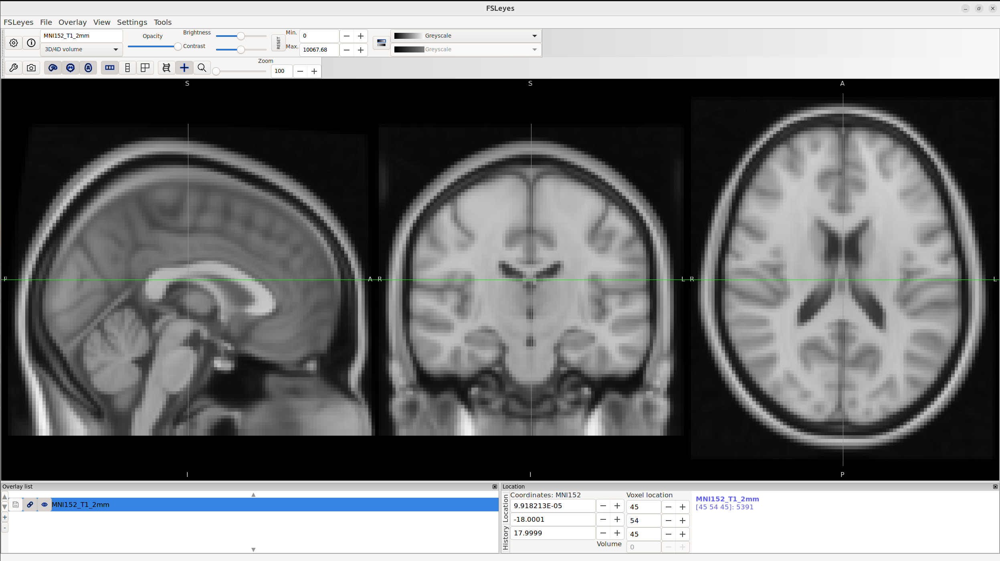

# FSL (to use with CPUs)

FSL is a comprehensive library of analysis tools for FMRI, MRI and diffusion brain imaging data. 
Most of the tools can be run both from the command line and as GUIs ("point-and-click" graphical user interfaces).

# Description

In this repository is provided a Dockerfile to build FSL (with a working `fsleyes`) using a base Ubuntu image.

**Warning: this repository does not include the FSL application itself.**

The user has to obtain the file called `fslinstaller.py` from  https://fsl.fmrib.ox.ac.uk/fsldownloads_registration after registering and reading/accepting the terms of the FSL software License.

# Build (with Docker)

In order to build the FSL container:

1- clone this repository using for example `git clone https://github.com/j34ni/FSL.git`

2- copy the downloaded `fslinstaller.py` in the `FSL` directory and cd into it

3- with Docker installed (see https://docs.docker.com/engine/install/ubuntu/#install-using-the-convenience-script) type: `docker build --progress=plain -t fsl -f Dockerfile .`

### Run with Docker

To start the container with Docker type `docker run -it --rm -e DISPLAY=$DISPLAY -v /tmp/.X11-unix:/tmp/.X11-unix fsl:latest`

## Conversion to Singularity Image File
To convert the Docker image into a Singularity Image File that can be used with Singularity/Apptainer type `docker save fsl -o fsl.tar`, then transfer this tarball on a host with Singularity (or Apptainer installed) and convert it to .sif using: `singularity build fsl.sif docker-archive://fsl.tar`.

### Run with Singularity/Apptainer

The container can be started with: `singularity shell --env DISPLAY=$DISPLAY --bind /tmp/.X11-unix:/tmp/.X11-unix fsl.sif`.

Notice that if for instance Apptainer is not installed on the host (and provided the Administrator allows it) you can install it yourself as an ordinary user (see https://apptainer.org/docs/admin/latest/installation.html).

Once inside the container (either using Docker or Singularity/Apptainer) FSL binaries should be directly usable (if not simply source an FSL setup file `source $FSLDIR/etc/fslconf/fsl.sh`) and it is ready to run your analysis.

## Bindings

Do not forget to *bind* the folders containing your data on the host (i.e., the personal computer or HPC with the runnign container) to make then *visible* inside the container. With Docker this is done with the `-v` keyword and with Singularity/Apptainer with the `--bind` keyword (see https://singularity-userdoc.readthedocs.io/en/latest/bind_paths_and_mounts.html).

## Running on a remote host (ssh -X)

If you run the container on a remote host you need to login with the `-X` option to allow display on your local computer (typically `ssh -i ~/.ssh/your_ssh_key -X your_username@host_name`).

## Example with fsleyes

As an example the command `fsleyes -std` should open on your local computer a window showing something like:

# Citation

Should you use this container recipe and/or related material please cite: Iaquinta, J. (2024). j34ni/FSL: Version 1.0.0 (v1.0.0). Zenodo. https://doi.org/10.5281/zenodo.13742579

